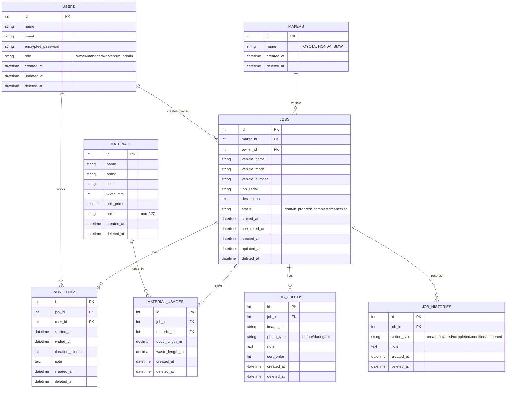

# WRAPP

> Car Wrapping 職人向け施工管理アプリ
> 1人でも、チームでも使える

## 概要
WRAPP は、カーラッピング職人の
- 作業時間
- 使用材料
- 施工内容

を、**現場作業を邪魔せずに簡単に記録**することを目的としたアプリです。

日々の施工を記録することで、
将来的に **見積もり・施工管理・請求業務** に活用できます。

---

## 今までの記録方法と課題
これまで多くの現場では、以下のような方法が使われてきました。

- 施工内容はスプレッドシートで管理
- 施工写真は LINE や Google Drive に分散
- 見積もりは経験や知識がないと作成が難しい
- スケジュール管理は手書きやスプレッドシートのため、チーム内での変更が分かりにくい

これにより、
- 情報が散らばる
- 過去の施工を活かしづらい
- 作業以外の負担が増える

といった課題が生まれています。

---

## このアプリの特徴
- 施工内容・時間・材料を一箇所にまとめて記録
- 開始／終了の簡単操作で作業時間を記録
- 写真とメモで施工の履歴を残せる
- 1人職人でもすぐに使えるシンプル設計
- チーム運用・見積もり・請求へ拡張可能な設計

---

## コンセプト

管理のためのアプリではなく、**職人が煩わしい管理を簡略化し施工に集中できる環境をつくるためのアプリ**

### データ保護方針
- 施工記録は履歴資産として扱い、削除は行わず状態管理で運用
- 削除できない設計は、職人を守るための設計

---

## 技術スタック

### バックエンド
- **Ruby on Rails 7.1+**
- **PostgreSQL 16**
- **Devise**（認証）
- **Active Storage**（画像管理）
- **Hotwire (Turbo + Stimulus)**

### フロントエンド
- **Tailwind CSS**
- **Material Symbols Icons**

### インフラ
- **Docker & Docker Compose**
- **Redis**（キャッシュ/ジョブキュー）

### テスト・品質
- **RSpec**
- **RuboCop**

---

## 開発環境セットアップ

### 必要なソフトウェア
- Docker Desktop
- Git

### セットアップ手順

```bash
# リポジトリのクローン
git clone <repository-url>
cd wrapp

# Docker環境のビルド
docker-compose build

# データベースのセットアップ
docker-compose run web rails db:create
docker-compose run web rails db:migrate
docker-compose run web rails db:seed

# 開発サーバーの起動
docker-compose up

# ブラウザでアクセス
# http://localhost:3000
```

### よく使うコマンド

```bash
# コンテナの起動
docker-compose up

# バックグラウンドで起動
docker-compose up -d

# コンテナの停止
docker-compose down

# Railsコンソール
docker-compose run web rails console

# マイグレーション実行
docker-compose run web rails db:migrate

# テスト実行
docker-compose run web rspec

# Gemのインストール
docker-compose run web bundle install
docker-compose build  # 再ビルドが必要

# コンテナに入る
docker-compose exec web bash
```

### Docker構成

```yaml
services:
  web:      # Rails 7.1
  db:       # PostgreSQL 16
  redis:    # Redis (キャッシュ/ジョブキュー)
```

---

## データ設計

### ER図



---

### USERS（職人・利用者）

誰が施工したかを管理するテーブル

**主な項目**
- 職人の名前
- ログイン情報

**なぜ必要？**
- 一人職人でも「自分＝1ユーザー」として扱える
- 将来チームになったとき、誰がどの施工を担当したかを残せる

### MAKERS（メーカー）

車のメーカーを選択肢として管理するテーブル

**主な項目**
- メーカー名（TOYOTA、HONDA、BMW など）

**なぜ必要？**
- 表記ブレを防ぐ
- メーカー別の施工実績を集計できる
- 車種までは管理しないが、メーカーだけは揃えるのが一番楽で効果が高い

### JOBS（施工案件）

このアプリの中心。1回の施工＝1レコード

**主な項目**
- 車の情報（メーカー・車種・型式・ナンバー）
- 施工内容
- 施工状態（作業中／完了）
- 施工シリアル

**なぜ必要？**
- 「いつ・どの車に・何をしたか」を残すため
- 見積・請求・後施工のすべての起点になる

### WORK_LOGS（作業時間ログ）

施工にかかった時間を記録するテーブル

**主な項目**
- 作業開始・終了時間
- 作業した職人
- 合計作業時間

**なぜ必要？**
- 見積を感覚ではなく実績で出せる
- 職人の負担や成長が見える
- 時間は利益と直結する

### MATERIALS（材料マスタ）

使用するフィルムや材料の一覧

**主な項目**
- フィルム名
- メーカー
- 色・幅など

**なぜ必要？**
- 同じ材料を何度も入力しなくて済む
- 材料ごとの使用実績を集計できる

### MATERIAL_USAGES（材料使用実績）

どの施工で、どの材料をどれだけ使ったか

**主な項目**
- 使用した材料
- 使用量
- ロス量

**なぜ必要？**
- 材料ロスを見える化
- 車種ごとの適正使用量を知るため
- 利益を守るための記録

### JOB_PHOTOS（施工写真）

施工前・途中・完了の写真を保存

**主な項目**
- 写真
- 簡単なメモ

**なぜ必要？**
- 後施工・クレーム対応の証拠
- 施工ノウハウの蓄積

### JOB_HISTORIES（後施工・履歴）

再施工や修正の履歴を残す

**主な項目**
- 再施工・剥がし・補修など
- その理由や内容

**なぜ必要？**
- 「この車、何回手を入れたか」が分かる
- 保証対応の判断材料になる

---

## 権限設計

### ロール定義
- **OWNER**：施工データの最終責任者
- **MANAGER**：運用責任者（管理＋現場作業）
- **WORKER**：作業者（現場専念）
- **SYS_ADMIN**：運営・保全専用（通常ユーザーは持たない）

### 操作別 権限一覧

| 操作カテゴリ | 操作内容 | OWNER | MANAGER | WORKER | SYS_ADMIN |
|---|---|---|---|---|---|
| 施工（JOB） | JOB作成 | ✅ | ✅ | ❌ | ❌ |
|  | JOB編集（施工内容） | ✅ | ✅ | ❌ | ❌ |
|  | JOBオーナー変更 | ✅ | ❌ | ❌ | ❌ |
|  | status変更（draft / cancelled / completed） | ✅ | ✅ | ❌ | ❌ |
| 人の割当 | 作業者割当・変更 | ✅ | ✅ | ❌ | ❌ |
| 作業記録 | 作業ログ追加 | ✅ | ✅ | ✅ | ❌ |
|  | 作業ログ編集 | ✅ | ✅ | 自分のみ | ❌ |
| 材料 | 材料使用記録追加 | ✅ | ✅ | ❌ | ❌ |
| 写真 | 写真追加 | ✅ | ✅ | ✅ | ❌ |
|  | 写真メモ編集 | ✅ | ✅ | 自分のみ | ❌ |
| 閲覧 | 施工一覧・詳細閲覧 | ✅ | ✅ | 割当分のみ | ❌ |
| ユーザー管理 | WORKER追加・削除 | ✅ | ✅ | ❌ | ❌ |
|  | MANAGER追加・削除 | ✅ | ❌ | ❌ | ❌ |
| 削除 | 論理削除（deleted_at） | ❌ | ❌ | ❌ | ✅ |
|  | 物理削除 | ❌ | ❌ | ❌ | ❌ |
| システム | データ復元 | ❌ | ❌ | ❌ | ✅ |

### 削除ポリシー
- 施工データは資産として扱う
- 通常ユーザーは削除不可
- 削除は SYS_ADMIN のみが実施
- 現場運用は status 管理で対応する

### 補足
- MANAGER は管理業務に加え、現場作業にも参加できる
- SYS_ADMIN 権限は運営・保全目的のみで使用する
